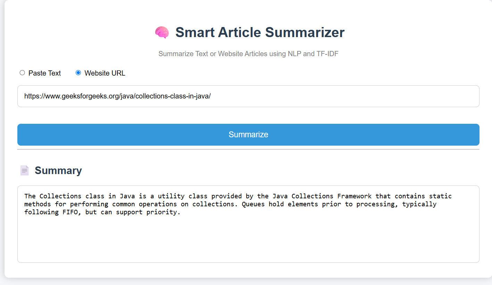

# 🧠 Smart Article Summarizer

A Flask-based NLP application that generates concise summaries from **text** and **website articles** using **TF-IDF** and **Natural Language Processing (NLP)**.

## ✨ Features

- ✍️ Summarize pasted text
- 🌐 Summarize website articles using URLs
- 🧹 Text preprocessing with NLTK
- 📊 TF-IDF based extractive summarization
- 💻 Interactive Flask web interface

## 🛠️ Tech Stack

- Python
- Flask
- NLTK
- Scikit-learn (TF-IDF)
- BeautifulSoup4
- Requests
- HTML
- CSS

## 📂 Project Structure

```
Smart-Article-Summarizer/
│── app.py
│── requirements.txt
│── templates/
│── static/
│── utils/
└── screenshots/
```

## 🚀 How to Run

```bash
git clone <repository-url>
cd Smart-Article-Summarizer

python -m venv venv
venv\Scripts\activate

pip install -r requirements.txt
python app.py
```

Open your browser:

```
http://127.0.0.1:5000
```

## 📸 Screenshots

### Home Page


### Text Summarization


### Website URL Summarization


## 🔮 Future Improvements

- Summary length selection
- Better URL validation
- Copy summary button
- Transformer-based summarization

## 👩‍💻 Author

**G. Naga Lahari**
